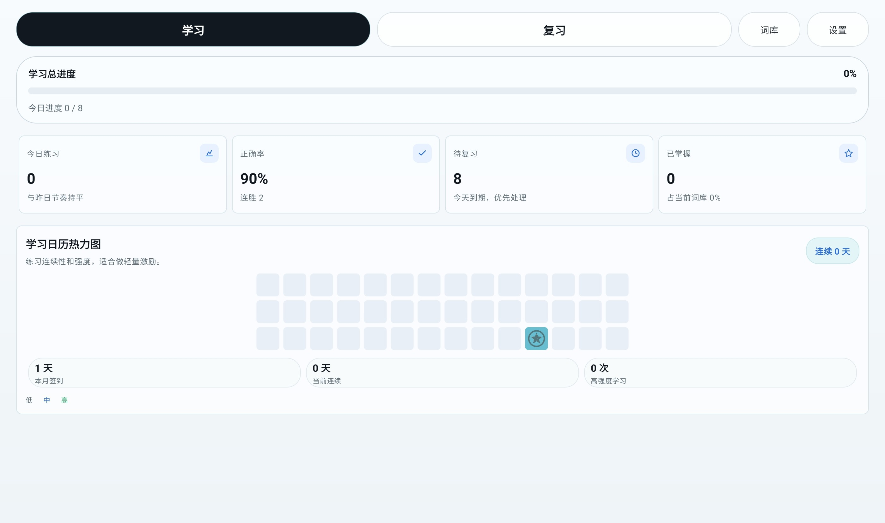
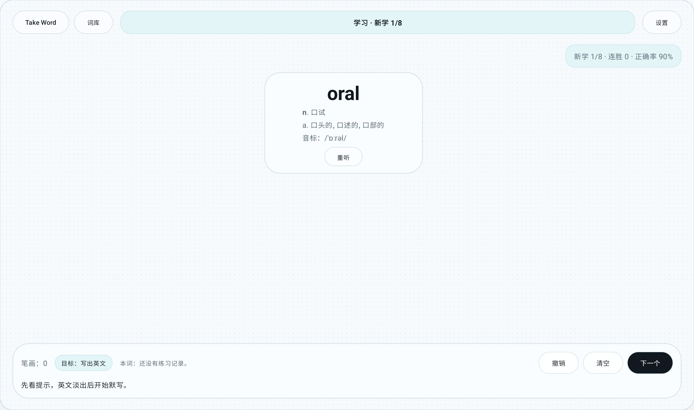
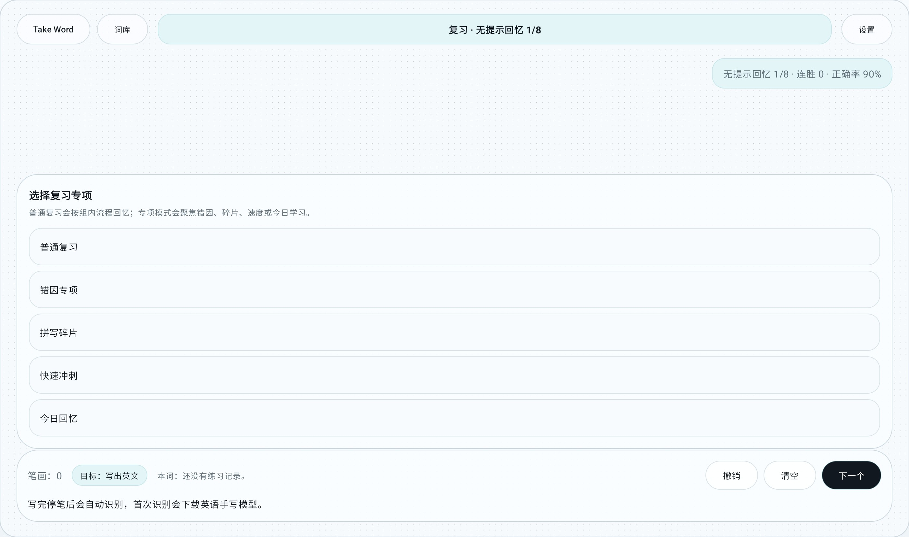
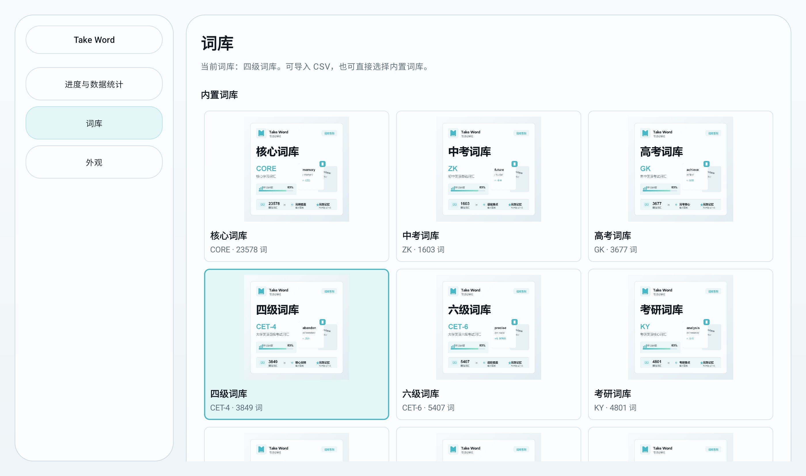
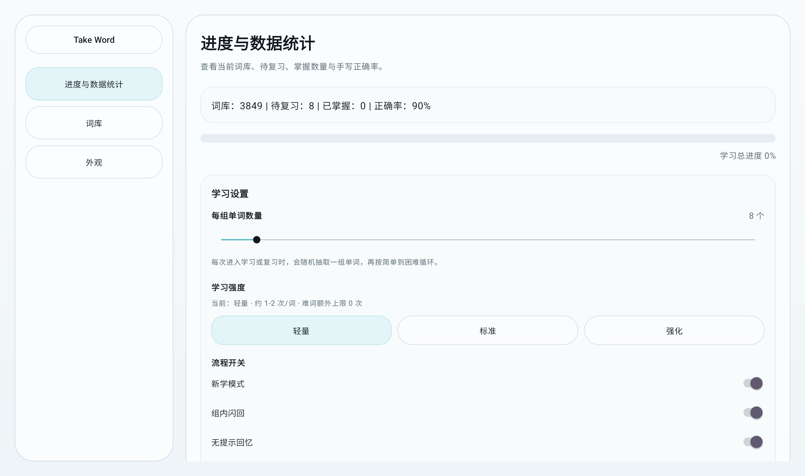
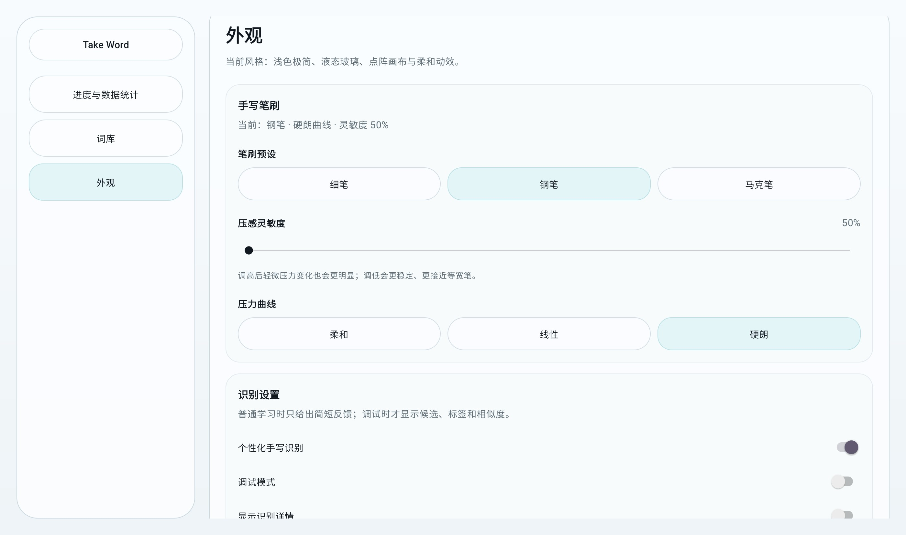

# Take Word

**以手写默写为核心的 Android 单词学习应用。**

Take Word 通过中文释义、发音、阶段化复习和手写识别，帮助用户把英文单词从“看过”练到“能写出”。

## 简介

Take Word 是一款 Android 原生记单词应用。它不把学习过程简化成点击卡片，而是围绕“听到、想起、写出、确认”组织练习：用户根据中文释义、音标、例句或发音提示，在画布上手写英文单词，应用自动识别笔迹并记录学习结果。

应用界面以平板横屏为优先场景，同时适配手机竖屏。视觉风格保持浅色、干净、克制，学习页面以大面积手写画布为主，减少不必要的信息干扰。

## 截图

| 首页统计 | 学习画布 |
| --- | --- |
|  |  |

| 复习入口 | 词库设置 |
| --- | --- |
|  |  |

| 学习设置 | 外观设置 |
| --- | --- |
|  |  |

## 下载

正式构建建议通过 GitHub Releases 发布。

运行要求：

- Android 7.0 或更高版本。
- 首次使用手写识别时，可能需要联网下载英语手写识别模型。

发布文件说明见 [releases/README.md](releases/README.md)。

## 功能

- 以手写默写为核心的单词练习流程。
- 基于 ML Kit Digital Ink Recognition 的自动手写识别。
- 组内多阶段学习：新学、闪回、无提示回忆、确认掌握、错题插队、难词加倍、拼写碎片、错因专项、快速冲刺和今日回忆。
- 本地词库管理，支持内置词库和 CSV 导入。
- 学习进度统计，包括正确率、待复习、已掌握、连胜和学习热力。
- 发音播放，支持词条音频优先，Android TextToSpeech 兜底。
- 可调节墨迹手感，支持笔刷预设、压感灵敏度和压力曲线。
- 轻量、极简的平板横屏界面，并兼顾手机竖屏使用。

## 文档

- [开始使用](docs/getting-started.md)
- [学习流程](docs/learning-flow.md)
- [手写识别](docs/handwriting-recognition.md)
- [词库格式](docs/word-bank.md)
- [复习与进度](docs/review-and-progress.md)
- [设置说明](docs/settings.md)
- [隐私与授权](docs/privacy-and-licenses.md)
- [常见问题](docs/faq.md)

## 隐私

Take Word 以本地学习为主。词库、识别结果、学习进度和设置默认保存在设备本地。用户导入的词库和音频文件由用户自行管理。

详细说明见 [隐私与授权](docs/privacy-and-licenses.md)。

## 参与贡献

公开仓库准备完成后，欢迎通过 Issue 和 Pull Request 参与。对于较大的界面、学习流程或数据结构调整，建议先提交 Issue 讨论设计方向，再开始实现。

## 免责声明

Take Word 是学习辅助工具。识别结果、正确率、掌握状态和进度统计仅用于帮助用户安排练习，不应视为正式考试或认证结果。

应用不提供商业词典服务、云端教学服务或考试成绩保证。用户导入的词库、例句、释义和音频文件应由用户或分发者自行确认使用权。

## 许可证

项目正在准备公开发布。如果仓库未包含 `LICENSE` 文件，则源码和随包素材默认不授予第三方再分发或复用许可。

第三方依赖、词库和素材来源记录见 [隐私与授权](docs/privacy-and-licenses.md)。
